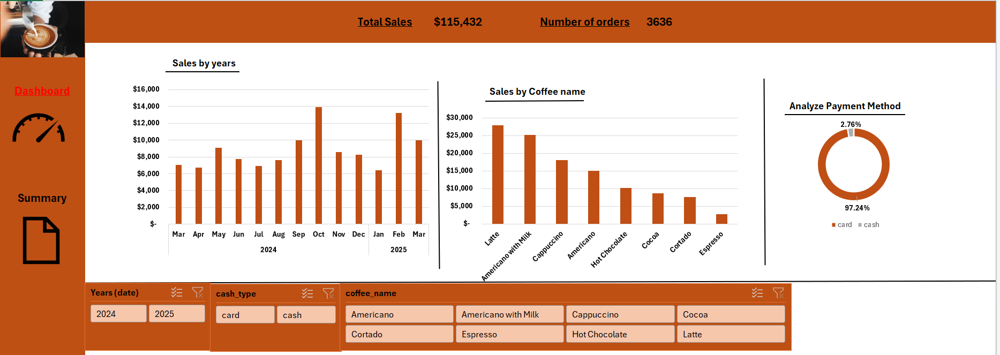

# Coffee Drinks Sales Dashboard

This Excel project analyzes and visualizes coffee drinks sales data, helping understand sales trends, popular products, and preferred payment methods.

## 📊 Dashboard Preview

## 📁 Contents

- `Coffee_Drinks.xlsx`: The main dataset and dashboard.
- `Dashboard_preview.png`: A snapshot of the dashboard visualization.

## ✨ Features

- Sales by year and month
- Top-selling coffee drinks
- Payment method analysis
- Interactive slicers for year, payment type, and coffee name

## 🚀 How to Use

1. Download the Excel file.
2. Open in Microsoft Excel.
3. Explore the dashboard and apply filters.